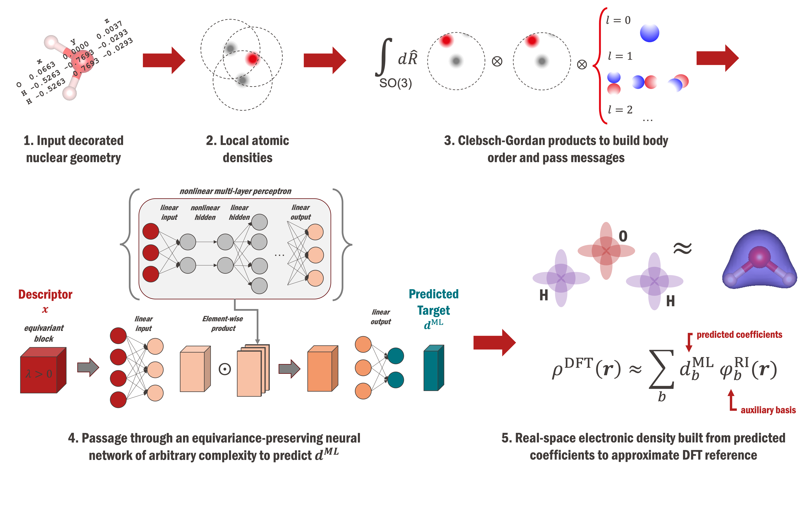

# Part 2: Train a surrogate model with `rholearn`

## 2.1: Specify ML settings

First copy files `part-1-dft/{dft_settings,hpc_settings}.py` into the current directory `part-2-ml/`. Next, inspect the user settings file `ml_settings.py` and edit the appropriate fields.

You can also inspect the default DFT settings, which can be printed with:
```python
import pprint
from rholearn.settings.defaults import ml_defaults

pprint.pprint(ml_defaults.ML_DEFAULTS)
```
Any of these can be modified by specification in the local file `ml_settings.py`.

## 2.2: Key parts of the training workflow

The end-to-end pipeline central to `rholearn` is shown in the following schema.



**Constructing an equivariant descriptor.** A system of interest is expressed as decorated (i.e. atom-typed) nuclear coordinates. Basis functions are placed on each atomic center to generate a smooth atomic density field, and local atomic environments (within a cutoff) defined for each atom. In the spherical basis, higher body order descriptors are built by taking Clebsch-Gordan tensor products of atom-centered densities. These transformations comprise the steps in constructing an (at present not learnable) equivariant descriptor that encodes geometric information about the molecule/material. **`rascaline`** is used to generate the atomic density descriptor, and perform the Clebsch-Gordan products to increase body order.

**Predicting on a basis**. The local user-settings file `net.py` and default file `rholearn.settings.defaults.net_default` contains the neural network (NN) architecture used to initialize the model. By default, this is just a simple linear layer. The equivariant descriptor is passed through the NN to form a vector a predicted coefficients on the output layer. The transformations of the NN are defined by learnable weight tensors that are optimized during training. **`metatensor-learn`** modules are used to construct dataset and dataloaders, and define NN architectures.

**Building the field.** Finally, the predicted coefficients are passed back into the electronic structure code **`FHI-aims`** to rebuild the real-space electronic density.


## 2.3: Train a model

**Training a model locally** can be done as follows:

```python
import rholearn

from dft_settings import DFT_SETTINGS
from ml_settings import ML_SETTINGS
from net import NET

rholearn.train(DFT_SETTINGS, ML_SETTINGS, NET)

# Alternatively: a one-liner for the command line
python -c 'import rholearn; from dft_settings import DFT_SETTINGS; from ml_settings import ML_SETTINGS; from net import NET; rholearn.train(DFT_SETTINGS, ML_SETTINGS, NET);'
```

The file `hpc_settings.py` is not used by the `rholean.train` function. Instead, **to run training on a cluster**, the one-line python command can be incorporated into an HPC run script. In this case, ensure that the calculation is run from within the `rho` conda environment. For slurm schedulers, this is done with the `--get-user-env` flag:

```bash
#!/bin/bash
#SBATCH --job-name=ml
#SBATCH --nodes=1
#SBATCH --time=01:00:00
#SBATCH --partition=standard
#SBATCH --ntasks-per-node=40
#SBATCH --get-user-env

python -c 'import rholearn; from dft_settings import DFT_SETTINGS; from ml_settings import ML_SETTINGS; from net import NET; rholearn.train(DFT_SETTINGS, ML_SETTINGS, NET);'
```

Once running, the model is trained by gradient descent over a number of epochs, and information is logged to `part-2-ml/logs/train.log`. There is some preamble regarding model architecture, and cross-validation splits of data, then information from the training loop is printed, of the form:
```bash
epoch 0 train_loss 1259567.8746709786 val_loss 732263.7933436064 dt_train 0.492 dt_val 0.132 lr 0.1
epoch 100 train_loss 50.45056127415962 val_loss 255.06999044889676 dt_train 0.337 dt_val 0.128 lr 0.01
```
where the training and validation losses are computed as the L2 loss on the ML-predicted density against the reference RI-basis reconstruction of the density in real-space. When the (mutually consistent) basis set definition is inserted, the loss becomes (and how it is evaluated in practice):
$$
\begin{align}
\mathcal{L}(\textbf{w}) &= | \rho^{\text{ML}}(\textbf{r, \textbf{w}}) - \rho^{\text{RI}}(\textbf{r}) | ^ 2 \\
&= (\textbf{d}^{\text{ML}}(\textbf{w}) - \textbf{d}^{\text{RI}}) \ \hat{S}^{\text{RI}} \ (\textbf{d}^{\text{ML}}(\textbf{w}) - \textbf{d}^{\text{RI}})
\end{align}
$$

where $\textbf{w}$ are the trainable model parameters, $\textbf{d}^{\text{X}}$ are the ML-predicted or RI-fitted expansion coefficients, and $\hat{S}^{\text{RI}}$ is the overlap matrix of the RI basis functions.

Model, optimizer, and scheduler checkpoints are saved to the `checkpoint/` directory at regular intervals.


## 2.4: Evaluate the model

The model can then be evaluated on the test set as follows:

```python
import rholearn

from dft_settings import DFT_SETTINGS
from ml_settings import ML_SETTINGS
from hpc_settings import HPC_SETTINGS

rholearn.eval(DFT_SETTINGS, ML_SETTINGS, HPC_SETTINGS)

# Alternatively: a one-liner for the command line
python -c 'import rholearn; from dft_settings import DFT_SETTINGS; from ml_settings import ML_SETTINGS; from hpc_settings import HPC_SETTINGS; rholearn.eval(DFT_SETTINGS, ML_SETTINGS, HPC_SETTINGS);'
```
As evaluation of the model requires rebuilding the field in FHI-aims, the `rholearn.eval` function requires specification of the local file `hpc_settings.py`.

Once running, information is logged to `part-2-ml/logs/eval.log`. First, model inference is performed: the nuclear coordinates of the test structures are transformed into an atom-centered density correlation descriptor, then passed through the neural network to yield the predicted coefficients on the RI basis. Then, the predicted coefficient vector for each structure is passed (in parallel) back into `FHI-aims`. The fields are built in real space and the model error is evaluated per structure.

```bash
system 31 abs_error 38.81341 norm 31.99745 nmae 121.30156 squared_error 134.77636
system 19 abs_error 78.85176 norm 32.00184 nmae 246.39755 squared_error 1471.64144
```
`system` is the index of the frame/structure being evaluted, `abs_error` the absolute error between predicted and reference field in real-space (numerator of expression below), `norm` is the normalization factor, i.e. the integrated reference field (denominator), `nmae` is the former divided by the latter, and `squared_error` is the squared error (L2 loss as in the above loss expression).

The evaluation metric commonly used is the normalized mean absolute error (% NMAE) between the ML-predicted density and the reference density. The reference density may either be the RI reconstructed density or the original SCF density:

$$
\begin{align}
\text{\% NMAE} = \frac{ \int_\R d\textbf{r} | \rho^{\text{ML}}(\textbf{r}) - \rho^{\text{ref}}(\textbf{r}) | }{\int_\R d\textbf{r} \rho^{\text{ref}}(\textbf{r})}
\end{align}
$$

using $\rho^{\text{SCF}}(\textbf{r})$ as the reference density computes the error on the actual target field of interest. However, as ML models trained against density fitted reference data intrinsically inherit the density fitting error, evaluating model performance as the error on the RI density $\rho^{\text{RI}}(\textbf{r})$ is sometimes more useful for separating errors between basis set expansion and model prediction.


## 2.5: Custom model architectures

One can define an arbitrary neural network architecture using `ModuleMap` objects from `metatensor-learn`, or by using the available convenience layers in `metatensor.torch.learn.nn`. For example, a small equivariance-preserving neural network comprised of `[LayerNorm, Linear, Tanh, Linear]` layers collected in a `Sequential` wrapper would be defined in the following way, and placed in the local user-settings file `net.py`:

```python
def net(
    in_keys: mts.Labels,
    in_properties: List[mts.Labels],
    out_properties: List[mts.Labels],
    dtype: torch.dtype,
    device: torch.device,
) -> torch.nn.Module:
    """Builds a NN sequential ModuleMap."""
    invariant_key_idxs = [
        i for i, key in enumerate(in_keys) if key["o3_lambda"] == 0
    ]
    sequential = nn.Sequential(
        in_keys,
        nn.InvariantLayerNorm(  # layer norm only applied to invariants
            in_keys=in_keys,
            invariant_key_idxs=invariant_key_idxs,
            in_features=[
                len(in_props)
                for i, in_props in enumerate(in_properties)
                if i in invariant_key_idxs
            ],
            dtype=dtype,
            device=device,
        ),
        nn.EquivariantLinear(
            in_keys=in_keys,
            invariant_key_idxs=invariant_key_idxs,
            in_features=[len(in_props) for in_props in in_properties],
            out_properties=out_properties,
            bias=True,  # bias is only applied to invariants
            dtype=dtype,
            device=device,
        ),
        nn.InvariantTanh(  # Tanh only applied to invariants
            in_keys=in_keys, invariant_key_=invariant_key_idxs,
        ),
        nn.EquivariantLinear(
            in_keys=in_keys,
            invariant_key_idxs=invariant_key_idxs,
            in_features=10,
            out_properties=out_properties,
            bias=True,  # bias is only applied to invariants
            dtype=dtype,
            device=device,
        ),
    )
    return sequential
```